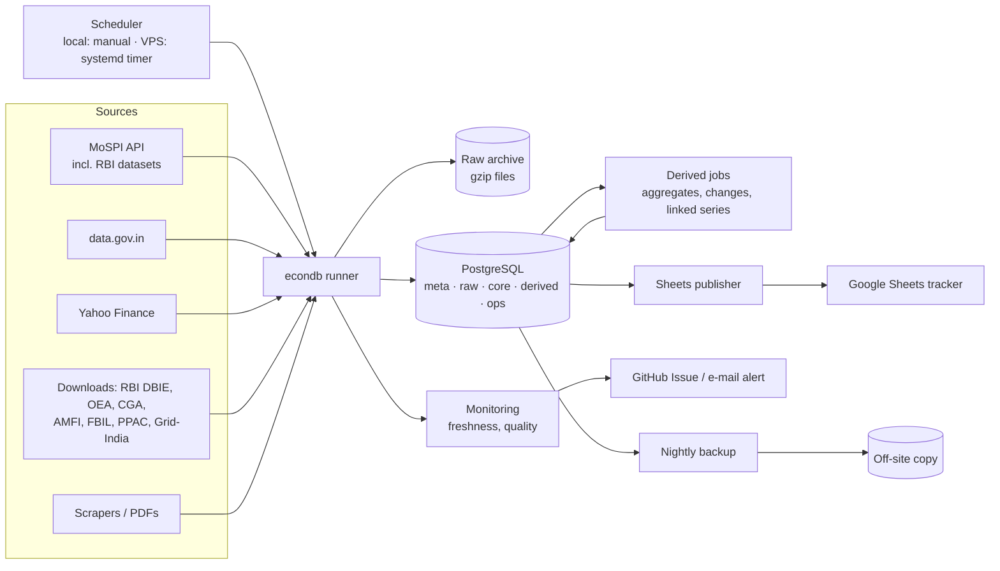

# Architecture

## 1. Overview


## 2. Environments
| | Local (build & test) | Production (VPS) |
|---|---|---|
| OS / shell | Windows / PowerShell | Linux / bash |
| PostgreSQL | 16.14 native Windows service, localhost:5432 | 16 (PGDG repo) on the VPS, listening on localhost only |
| Code | `D:\India-econ-db` | `/opt/econdb` (git clone, `git pull` to deploy) |
| Config | `.env` | `/etc/econdb/econdb.env` (root-readable only) |
| Raw archive | `D:\India-econ-db\data\raw` (git-ignored) | `/var/lib/econdb/raw` |
| Scheduler | run by hand / Windows Task Scheduler (optional) | systemd timer every 30 min → `econdb run --due`, as non-root user `econdb` with systemd `MemoryMax` |
| Access | direct | SSH on port 7576 (keys only after hardening; 443 belongs to nginx); DB via SSH tunnel (Tailscale under consideration) |

Moving local → VPS: `pg_dump -Fc` locally → `pg_restore` on the VPS (or re-run backfills from the raw archive).

### VPS host (shared — verified Sep 2026)
- Host IT Smart, data centre Gujarat, India (AS138246 Netclues). Ubuntu 22.04.5 LTS, 2 vCPU,
  7.8 GB RAM, **no swap**, 97 GB disk (65 GB free).
- **Shared with a live production app, Bharat Laws — hands off** (`docs/rules.md`):
  `bharatlaws-backend` (Flask/Gunicorn on 127.0.0.1:5000), nginx (80/443/888), MySQL (3306, not
  reachable externally), aaPanel/BT-Panel (`/www`, port 12844, publicly reachable), Acronis backup
  agents, sendmail.
- Firewall: ufw + aaPanel ipset, default deny. Publicly open: 7576 (SSH), 80, 443, 12844, 888,
  20/21/39000–40000 (FTP, nothing listening), 22 (unused). econdb adds no public ports.

## 3. Repository layout
```
India-econ-db/
├── CLAUDE.md
├── docs/            PRD, architecture, rules, phases, design, memory, reference/*.xlsx
├── db/migrations/   0001_schemas.sql, 0002_meta.sql, ...
├── src/econdb/
│   ├── cli.py            migrate | run | backfill | derive | publish | check
│   ├── config.py         env-var settings
│   ├── db.py             connection, upsert-if-changed, run logging
│   ├── periods.py        FY / quarter / week helpers
│   ├── archive.py        raw archive read/write
│   ├── quality.py        validation rules
│   ├── sources/          base.py, mospi.py, datagovin.py, yahoo.py, rbi_dbie.py, ...
│   ├── derive/           aggregate.py, changes.py, linking.py
│   ├── publish/          sheets.py (layout, groups, formulas, incremental writes)
│   └── monitor/          freshness.py, alerts.py
├── deploy/          systemd units, backup script, VPS setup notes
├── tests/           unit tests + fixtures (saved sample responses)
├── explore/         exploration scripts (reference only)
└── .env.example
```

## 4. Database design (PostgreSQL)
Schemas: `meta` (definitions) · `raw` (large source-shaped tables) · `core` (canonical observations)
· `derived` (computed) · `ops` (runs, alerts, migrations).

### meta
- `meta.source` — source_id, name, tier, base_url, adapter, schedule (cron, Asia/Kolkata), expected_lag_days, notes.
- `meta.series` — **series_id** (readable, e.g. `cpi.b2024.in.combined.general.index`), source_id, dataset,
  indicator, dimensions (jsonb: state, sector, item…), unit, scale, currency, price_basis (current/constant),
  seasonal_adj, freq, period_basis (FY/CY), base_year, agg_rule, source_params (jsonb), active, notes.
- `meta.linking_factor` — series_family, old_base, new_base, factor, source_ref, published_on.
- `meta.release_calendar` — source_id/series_id, reference_period, expected_release_date.
- `meta.sheet_column` — sheet_code, block_title, column_order, column_label, series_id, calc_kind, calc_lag
  (drives the Sheets publisher; seeded from `docs/reference/India_Econ_Tracker_Layout.xlsx`).

### core
- `core.observation` — series_id, period_start, period_end, freq, value numeric, estimate_stage,
  vintage_at timestamptz, run_id, raw_ref. **Append-only.**
  Unique (series_id, period_start, vintage_at). Index (series_id, period_start).
- View `core.latest` — latest vintage per (series_id, period_start).

### raw
- Big source-shaped tables kept out of `core` when very granular, e.g. `raw.mandi_price`
  (daily rows by state/district/market/commodity/variety) and full CPI item × state detail.
  Partition by year when > ~10 M rows.

### derived
- `derived.observation` — same shape as core plus `method`, `is_partial`, `derived_from`;
  rebuilt by derive jobs (idempotent). Covers W/M/Q/FY aggregates, change metrics, linked series.

### ops
- `ops.pipeline_run`, `ops.source_run` (status, rows_new, rows_revised, latest_period, error),
  `ops.quality_issue`, `ops.alert`, `ops.schema_migrations`.

Write rule: an incoming value is inserted only if (series_id, period_start) is new or its value/estimate
stage differs from `core.latest`. Re-running a job adds nothing.

## 5. Source adapters
Interface (`sources/base.py`):
`discover()` → series definitions · `fetch(since)` → raw payloads (archived) ·
`normalise(payload)` → DataFrame[series_id, period_start, period_end, freq, value, estimate_stage] ·
`validate(df)` → issues. The runner loads rows and records `ops.source_run`.
Shared helpers: HTTP session (UA, timeouts, retries/backoff, rate limit), pagination, gzip archive.

## 6. Scheduling
`econdb run --due` checks each `meta.source.schedule` and runs what is due. Typical windows (IST):
markets/FX/commodities daily 18:30 · mandi daily 20:00 · MoSPI daily 19:00 (releases usually 16:00) ·
RBI weekly Friday 19:30 · monthly downloads daily during their release windows.
Derive and publish run after loads; publish writes only changed cells.

## 7. Monitoring & alerts
- Freshness: compare latest_period with `meta.release_calendar`; late → alert.
- Failures: any failed source run → GitHub Issue via API (label `pipeline-failure`), closed automatically on next success.
- Quality: range, jump (> n σ), duplicates, unit mismatch; cross-checks (e.g. trade RBI vs Commerce).

## 8. Backups
Nightly `pg_dump -Fc` (compressed) + raw-archive sync → off-site (Supabase Storage bucket, Google Drive
via service account, or another provider). Keep 14 daily + 8 weekly + 12 monthly. Monthly restore test.

## 9. Security
SSH keys only, password login off; econdb opens no public ports (80/443/888/12844 serve the
co-hosted Bharat Laws app and aaPanel — see §2); PostgreSQL bound to localhost; pipeline runs as
non-root `econdb` user with systemd `MemoryMax`; separate DB roles (`econdb_owner`, `econdb_writer`,
`econdb_reader`); automatic security updates; fail2ban; secrets in env files with 600 permissions;
Google Sheets shared with named members only. Hardening backlog: Phase 7 in `docs/phases.md`.

## 10. Capacity
Curated `core` + `derived` ≈ low hundreds of MB; raw tables (mandi ≈ 2.4 M rows/yr, CPI detail) and
archive ≈ a few GB over several years — well within the VPS's 65 GB free (shared host: RAM is
7.8 GB with no swap until Phase 7 adds 2–4 GB, so keep the pipeline under `MemoryMax`). Plain PostgreSQL with good
indexes is sufficient; revisit partitioning/TimescaleDB only if queries slow down.
